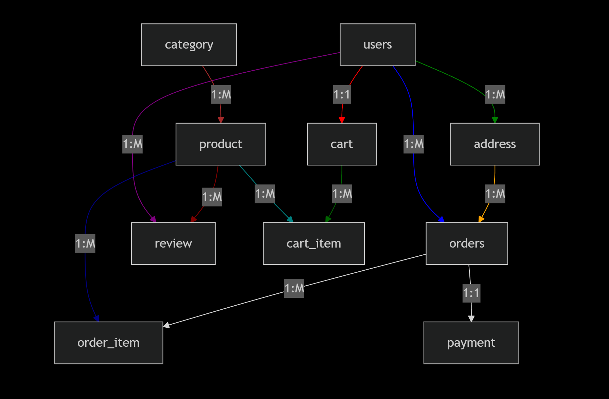

# Simple Relationship View

# Practice Complex Database using (Spring Boot Data Jpa)Hibernate Project

This is a **Spring Boot** demo project named `practice` demonstrating the use of:

- Spring Boot Web
- Spring Data JPA
- MySQL database
- Spring Boot Actuator
- Lombok

---

## Project Information

- **Group ID:** `com.springboot`
- **Artifact ID:** `practice`
- **Version:** `0.0.1-SNAPSHOT`
- **Java Version:** `25`
- **Description:** Demo project for Spring Boot
- **License:** [Add your license here]

---

## Maven Dependencies

The project uses the following Maven dependencies:

| Dependency | Purpose |
|------------|---------|
| `spring-boot-starter-web` | For building REST APIs and web applications |
| `spring-boot-starter-data-jpa` | For working with JPA and Hibernate |
| `spring-boot-starter-actuator` | For monitoring and management |
| `spring-boot-devtools` | For hot reloading during development |
| `mysql-connector-j` | MySQL database driver |
| `lombok` | Reduce boilerplate code using annotations |
| `spring-boot-starter-test` | For unit and integration testing |

---

## Project Structure
practice/
├─ src/
│ ├─ main/
│ │ ├─ java/com/springboot/
│ │ │ └─ Application.java
│ │ └─ resources/
│ │ └─ application.properties
│ └─ test/
│ └─ java/com/springboot/
├─ pom.xml
└─ README.md
